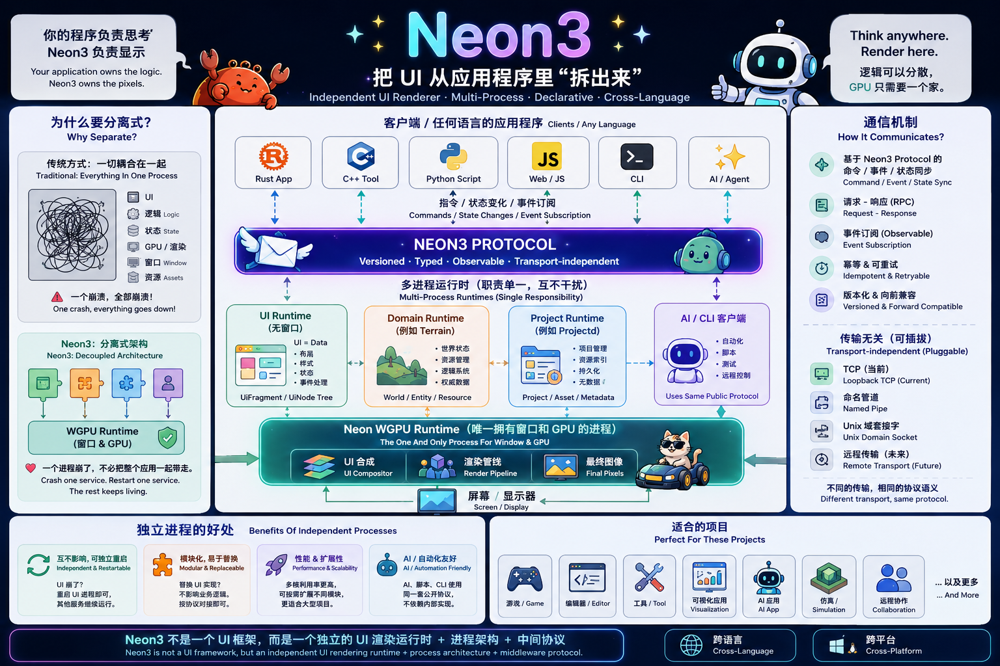
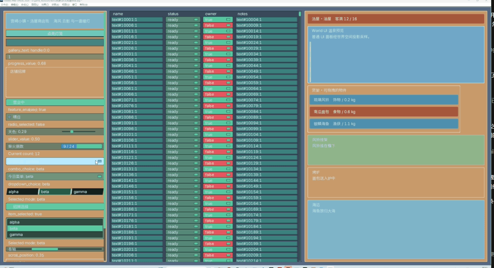

# Neon3

<p align="center">
  <a href="README.md">中文</a> ·
  <a href="README.en.md"><strong>English</strong></a>
</p>

<p align="center"><strong>An independent UI rendering runtime, process architecture, and public protocol</strong><br />
Neon3 owns the window and GPU. Applications in any language submit UI, state, and interactions through one public protocol.</p>

<p align="center"></p>

## Start With Examples

| Example | What it covers | Run |
| --- | --- | --- |
| [Neon3 Inventory Example](https://github.com/unco999/Neon3-example) | Python / Node.js inventory, drag and drop, capacity switching, real runtime probe | [Open and run](https://github.com/unco999/Neon3-example#quick-start) |
| `component-gallery` | Rust smoke test for controls, DataGrid, Tooltip, drag and drop, dropdowns, and world UI | `cargo run -p neon-dev -- case component-gallery --show-logs` |

```powershell
cargo build -p neon-projectd -p neon-eventd -p neon-ui-runtime -p neon-wgpu-runtime -p neon-dev --bins
cargo run -p neon-dev -- case component-gallery --show-logs
```



## SDKs and Clients

| Client | Status | Links |
| --- | --- | --- |
| Python SDK | Published | [PyPI: neon3-sdk](https://pypi.org/project/neon3-sdk/) · [Source](https://github.com/unco999/Neon3Sdk) |
| Node.js SDK | Published | [npm: @neon3/sdk](https://www.npmjs.com/package/@neon3/sdk) · [Source](https://github.com/unco999/Neon3Sdk) |
| Rust Client SDK | In development | [Neon3 SDK](https://github.com/unco999/Neon3Sdk) |
| C / C++ DLL SDK | In development | [Neon3 SDK](https://github.com/unco999/Neon3Sdk) |

The Python and Node.js SDKs resolve and download the latest Windows runtime from GitHub Releases by default. Set `NEON3_RUNTIME_VERSION` only when a pinned version is required for reproduction.

## Repositories

- [Neon3 Runtime](https://github.com/unco999/Neon3-CiJian)
- [Neon3 SDK](https://github.com/unco999/Neon3Sdk)
- [Bevy NUI Plugins](https://github.com/unco999/bevy-nui-plugins)
- [Neon3 Examples](https://github.com/unco999/Neon3-example)

## Build

```powershell
cargo build
cargo test --workspace
```

Requirements: Rust `1.85+`. Current release bundles target Windows x86_64.

## License

MIT or Apache-2.0.
